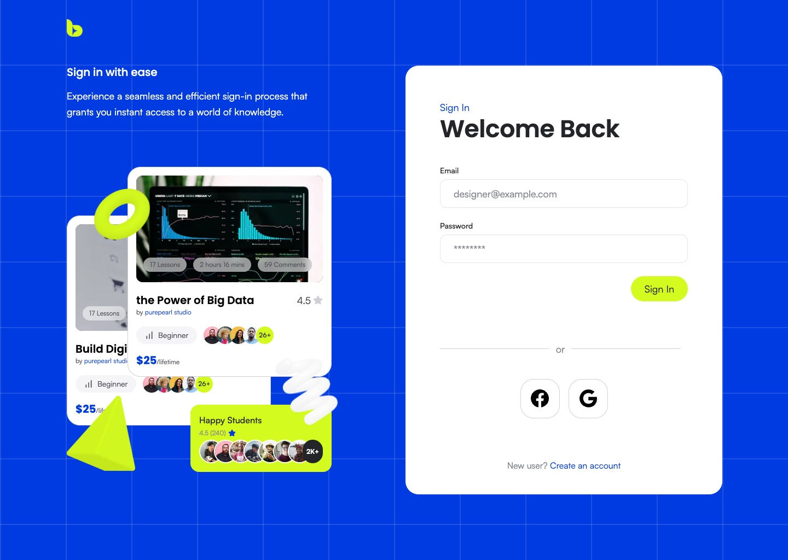

# ByteSpace

A responsive landing page for ByteSpace, an online learning platform, built from the provided Figma design as the Doin Tech Jr. Software Engineer (Frontend) assessment. The Login and Signup pages (bonus) are included.

**Live:** https://bytespace-new-three.vercel.app
**Repository:** https://github.com/Abrar118/bytespace-new


## Pages

| Route | Contents |
| --- | --- |
| `/` | Hero with course search, partner strip, Discover (category chips + course grid), Learning Paths, Feature Highlights, Creator CTA, Testimonials, footer with newsletter |
| `/login` | Sign-in form with social buttons and a course showcase |
| `/signup` | Account creation form sharing the same layout |



## Tech stack

- [Next.js 16](https://nextjs.org) (App Router, Turbopack, React Compiler) with React 19 and TypeScript
- Tailwind CSS 4, with design tokens defined in `app/globals.css`
- `next/font` for Poppins (headings) and Satoshi (body, self-hosted)
- `next/image` for all raster assets
- `lucide-react` for icons
- [Biome](https://biomejs.dev) for linting and formatting

## Getting started

Requires Node.js 20.9+.

```bash
npm install
npm run dev      # http://localhost:3000
```

Other scripts:

```bash
npm run build    # production build
npm run start    # serve the production build
npm run lint     # Biome check
npm test         # node:test checks
```

## Project structure

```
app/
  page.tsx            landing page (composes the sections below)
  login/, signup/     auth routes
  globals.css         Tailwind theme tokens and the grid backdrop
components/
  landing/            one component per landing section, plus shared cards and decorations
  auth/               AuthShell (shared auth layout), form field, submit button, form wrapper
data/                 typed mock content (courses, learning paths, testimonials)
public/assets/        images, avatars and 3D shape renders exported from Figma
```

## Implementation notes

- **Design fidelity.** Positions, sizes and colours come from the Figma SVG exports rather than being eyeballed. Each section was checked against the Figma PNG at 1440px by overlaying screenshots, and matches within about 1–2px.
- **Wide screens.** Content sits in a centred 1440px frame. The grid backdrop is aligned to that frame, and shapes that Figma crops at the frame edge stay flush with the viewport edge on wider screens.
- **Responsive.** The layout is checked at 375, 768, 1024, 1440 and 2000px with no horizontal overflow. Image compositions keep their proportions and scale down as a unit on smaller screens. The mobile header collapses into an accessible menu (Escape closes it).
- **Server-first.** Everything renders as server components. Only the mobile menu, the newsletter form and the auth form wrapper are client components.
- **Accessibility.** The page uses semantic landmarks and headings, labelled form fields, visible focus styles, and alt text for meaningful images; decorative shapes are hidden from assistive technology.
- **Mock data.** Course, testimonial and learning-path content lives in typed constants in `data/`; no mock-data packages are used.

## Scope and assumptions

- There is no backend. The search form submits a plain GET request (`/?q=…`). The newsletter, login and signup forms run native browser validation but do not send data anywhere.
- The Facebook and Google sign-in buttons are visual only.
- Footer links without a matching page are rendered as plain text rather than dead links.

## Workflow

Each piece of work was built on a feature branch and merged into `main` through a pull request ([#1 landing page](https://github.com/Abrar118/bytespace-new/pull/1), [#2 login and signup](https://github.com/Abrar118/bytespace-new/pull/2)). `main` is deployed to Vercel.
